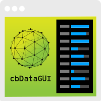

cbDataGUI GML Library
==========



cbDataGUI is an open-source, easy to implement GUI for manipulating object instance variables written in GML (Gamemaker Studio's scripting language)

Best fit for debugging, data visualization, demos and prototyping.

cbDataGUI is based on the idea and the look of Google’s Dat.GUI library.

[Marketplace Page for GMS1.4]:https://marketplace.yoyogames.com/assets/5601/cbdatagui-library-for-gms-1-4
[Marketplace Page for GMS1.9EA]:https://marketplace.yoyogames.com/assets/5619/cbdatagui-library-for-1-9-ea


Demos
-----
[Download Windows Demo]:http://github.com/aft/cbDataGUI-GML-Library/raw/master/bin/Win/cbDataGUI_win.zip (Scanned with AVG 17.5.3021 - Definition v. 170712-10) or

[Download OSX Demo]:https://github.com/aft/cbDataGUI-GML-Library/raw/master/bin/OSX/cbDataGUI_osx.zip (Scanned wıth AVG 17.2 - Definition v. 170712-10) from Github (Move it to Applications folder if you get 'Game not found' error.


Usage
-----


```gml
// String example
scr_cbDataGUI_add(obj_fizzy_text, "message", cbData_type.text, -1);

// Number example
scr_cbDataGUI_add(obj_fizzy_text, "pSpeed", cbData_type.number, -1); 

// Boolean example
scr_cbDataGUI_add(obj_fizzy_text, "displayOutline", cbData_type.boolean, -1); 

// Script example
scr_cbDataGUI_add(obj_fizzy_text, "scr_fizzy_text_explode", cbData_type.function, -1);

```


More Info
------
For more info, check the documentation [here]:http://cembaspinar.com/Docs/cbDataGUI/index.html


Contributing
-----
It's through your contributions that cbDataGUI will continue to improve. You can contribute in several ways.

**Issues:** Provide a detailed report of any bugs you encounter and open an issue.

**Documentation:** If you'd like to fix a typo or beef up the docs, you can fork the project, make your changes, and submit a pull request.

**Code:** Make a fix and submit it as a pull request. When making changes, add comments to describe the changes.


Author
------
Cem Baspinar

+ http://github.com/aft
+ http://twitter.com/aft


Thanks
------
Thanks to anyone who downloaded the extention from the marketplace.


Copyright and License
----
Copyright 2017 Cem Baspinar

Code released under the MIT License.